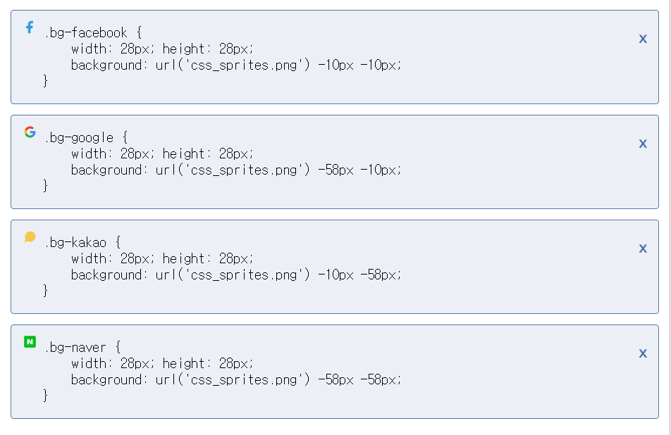

# CSS 스프라이트

- ## 정의

  => 여러가지의 이미지를 하나의 이미지 파일안에 배치하여 **이미지 로드 부담을 줄이는** 방법

- ## Image sprite generator

  https://www.toptal.com/developers/css/sprite-generator/

- ## 예시

  1. 다음은 위 사이트에서 여러가지의 이미지를 배치한 파일이다.
  <div align="center">
    
  </div>

  2. 사이트에서 각 로고별 위치를 제공한다.
  <div align="center">
    
  </div><br>

  3. 해당 위치에 맞춰서 스타일 속성을 주면 끝.

  ```html
  <!-- html -->
  <div class="social">
    <a href="#none" class="google social-link">구글 계정으로 로그인</a>
    <a href="#none" class="facebook social-link">페이스북 계정으로 로그인</a>
    <a href="#none" class="naver social-link">네이버 계정으로 로그인</a>
    <a href="#none" class="kakao social-link">카카오톡 계정으로 로그인</a>
  </div>
  ```

  ```css
  /* css */
  .social-link::before {
    margin-left: 15px;
    margin-right: -28px;
    margin-top: -3px;
    float: left;
    display: block;
    content: "";
    width: 28px;
    height: 28px;
    /* 이미지 스프라이트 url */
    background-image: url("images/css_sprites4x.png");
    background-size: 96px 96px;
  }
  /* 각각 위치 적용 */
  .google::before {
    background-position: -58px -58px;
  }
  .facebook::before {
    background-position: -10px -10px;
  }
  .naver::before {
    background-position: -58px -10px;
  }
  .kakao::before {
    background-position: -10px -58px;
  }
  ```

    <div align="center">
      
    </div><br>
    => 다음과 같이 이미지들이 잘 배치되었다.
