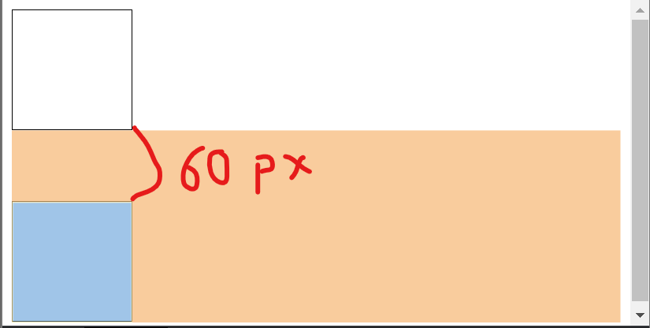
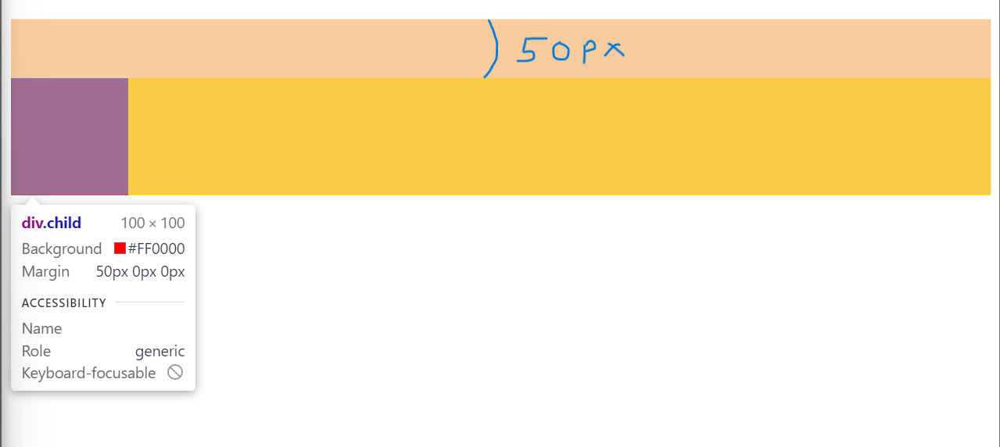
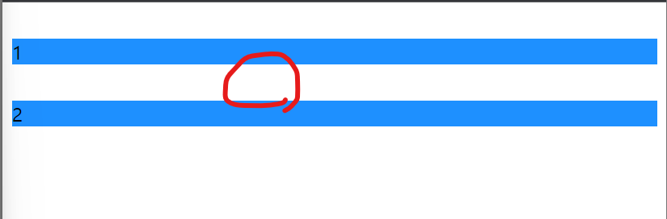

# Margin 겹침 현상

- 정의: **block 요소와 block 요소 사이**에 margin-top, margin-bottom의 공간이 있을 경우 **더 높은 값의 마진 값이 적용**되는 현상

* 예시 1. (현재 첫 번째 div => `margin-bottom: 30px;` 두 번째 div => `margin-top: 60px`) => **인접한 요소 간**

```html
<!DOCTYPE html>
<html lang="ko">
  <head>
    <meta charset="UTF-8" />
    <meta http-equiv="X-UA-Compatible" content="IE=edge" />
    <meta name="viewport" content="width=device-width, initial-scale=1.0" />
    <title>margin</title>
    <style>
      div {
        width: 100px;
        height: 100px;
        border: 1px solid black;
      }
      .first {
        margin-bottom: 30px; /* 상쇄됨 */
      }
      .second {
        margin-top: 60px;
      }
    </style>
  </head>
  <body>
    <div class="first"></div>
    <div class="second"></div>
  </body>
</html>
```

- 결과
<div align="center">
    
</div><br>
=> 다음과 같이 큰 값인 60px만 적용되었음을 확인할 수 있다.<br><br>

- 예시 2. **부모 자식 요소 간** 분리하는 content가 없을 때

```html
<!DOCTYPE html>
<html lang="ko">
  <head>
    <meta charset="UTF-8" />
    <meta http-equiv="X-UA-Compatible" content="IE=edge" />
    <meta name="viewport" content="width=device-width, initial-scale=1.0" />
    <title>margin</title>
    <style>
      .parent {
        background-color: yellow;
      }
      .child {
        width: 100px;
        height: 100px;
        margin-top: 50px; /* 부모 요소를 뚫고 margin이 발생 */
        background-color: red;
      }
    </style>
  </head>
  <body>
    <div class="parent">
      <div class="child"></div>
    </div>
  </body>
</html>
```

- 결과
<div align="center">
    
</div><br>
=> 다음과 같이 부모의 영역을 뚫고 자식의 마진이 발생된 것을 확인할 수 있다.<br><br>

- 예시 3. 빈 블록의 경우

```html
<!DOCTYPE html>
<html lang="ko">
  <head>
    <meta charset="UTF-8" />
    <meta http-equiv="X-UA-Compatible" content="IE=edge" />
    <meta name="viewport" content="width=device-width, initial-scale=1.0" />
    <title>margin</title>
    <style>
      .box {
        margin-top: 30px;
        background-color: dodgerblue;
      }
      .empty {
        margin-top: 30px; /* 빈 block의 마진이 상쇄 */
        background-color: yellow;
      }
    </style>
  </head>
  <body>
    <div class="box">1</div>
    <div class="empty"></div>
    <div class="box">2</div>
  </body>
</html>
```

- 결과
<div align="center">
    
</div><br>
=> 다음과 같이 빈 블록의 마진이 상쇄된 것을 확인할 수 있다.<br><br>

## 해결책

1. 인접 요소 간 => 마진이 상쇄된 요소에 `display: inline-block;`
2. 부모 자식 요소 간 => 부모에 `overflow: hidden;`
3. 빈 블록 => 빈 블록에 `display: inline-block;` 혹은 margin, height, padding 등 속성값을 부여

**해결책 같이 고민해보기!!**
