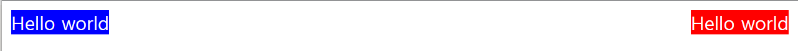
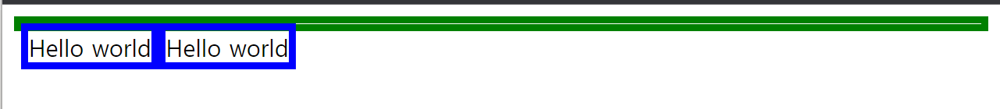
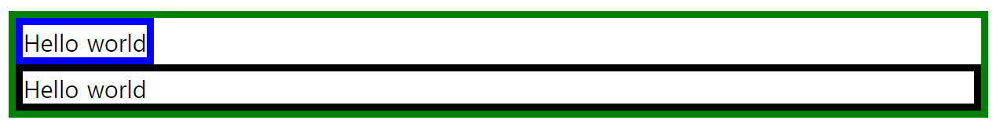
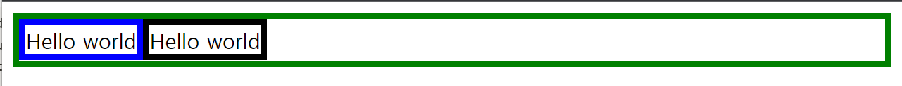

# float

- ## 정의

  => 다양한 객체를 띄워서 정렬을 시킬 수 있다. float 속성을 이용하여 **웹페이지 대부분의 레이아웃을 구현**할 수 있다.

- ## 속성

  - ### left, right
    ```html
    <!-- html -->
    <div class="content1">Hello World</div>
    <div class="content2">Hello World</div>
    ```
    ```css
    /* 첫 번째 div에 float 속성 부여 */
    div {
      color: #ffffff;
    }
    .content1 {
      background-color: blue;
      float: left;
    }
    .content2 {
      background-color: red;
    }
    ```
      <div align="center">
      
      </div>
      &nbsp;첫 번째 요소에 float:left 속성을 부여한 상태이다. 첫 번째 요소의 **크기가 콘텐츠 크기만큼**으로 조정되었다.
      <div align="center">
      
      </div>
      &nbsp; 다음은 첫 번째 요소에 left, 두 번째 요소에 right을 준 상태이다. 두 박스 요소 모두 콘텐츠 크기만큼만 영역을 차지한다.<br><br>

- ## float의 문제점

  => float 속성을 지닌 자식 요소를 감싼 부모 요소가 **자식 요소들의 높이를 반영하지 못하고 자신의 높이만큼만 보여준다**.

  ```html
  <!-- html -->
  <div class="container">
    <div class="content"></div>
    <div class="content"></div>
  </div>
  ```

  ```css
  .container {
    border: 5px solid green;
  }
  .hello {
    float: left;
    border: 5px solid blue;
  }
  ```

    <div align="center">
    
    </div>
    &nbsp; 다음과 같이 부모 요소가 자식 요소를 담지 못한다.<br><br>

- ## 해결책

  1. 부모 요소에 `overflow: hidden;` 적용<br>
     => **자식의 콘텐츠가 부모 요소를 넘어가면 가리는 부작용**이 발생할 수 있다.
  2. 부모 요소에 높이를 지정<br>
     => 반응형 웹을 구성하는데에 좋지 않은 선택이다.
  3. clear 속성 사용<br>
     => 부모에 적용하는 것이 아닌 float이 적용된 요소 바로 다음 적용, 적용된 float 방향에 맞춰서 clear 속성을 적용한다.

  ```html
  <!-- html -->
  <div class="container">
    <div class="hello1">Hello world</div>
    <div class="hello2">Hello world</div>
  </div>
  ```

  ```css
  .container {
    border: 5px solid green;
  }
  .hello1 {
    float: left;
    border: 5px solid blue;
  }
  .hello2 {
    /* clear 속성 적용 */
    clear: left;
    border: 5px solid black;
  }
  ```

    <div align="center">
    
    </div>
    4. clear-fix 사용<br>
    => ::after 가상요소로 해결한다. 부모 요소에 가장 마지막 자식 요소를 덧붙여서 부모가 마지막 자식 요소를 인식하여 float 문제점을 해결할 수 있는 방법이다.

  ```css
  /* css */
  .container {
    border: 5px solid green;
  }
  /* 가상 요소 추가 */
  .container::after {
    content: "";
    display: block;
    clear: both;
  }
  .hello1 {
    float: left;
    border: 5px solid blue;
  }
  .hello2 {
    float: left;
    border: 5px solid black;
  }
  ```

    <div align="center">
    
    </div>
