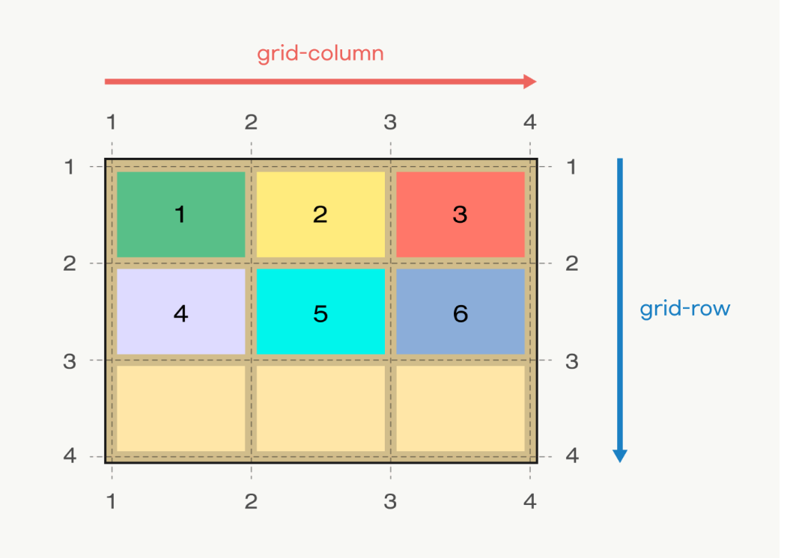
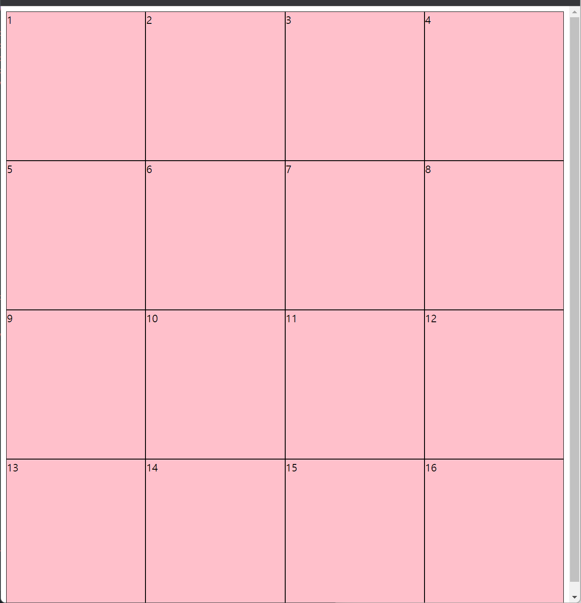
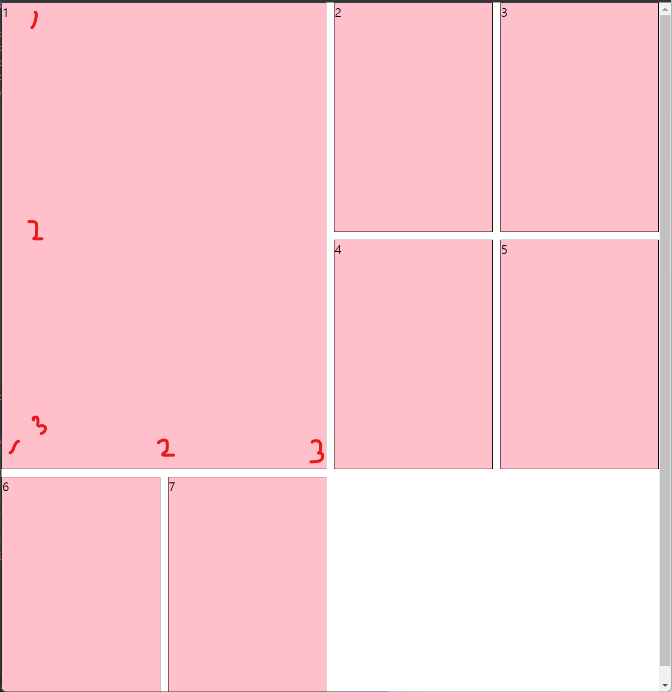

# grid

=> **웹 레이아웃을 구성**할 때 매우 유용하게 쓰이는 속성이다.

<div align="center">

</div><br>

- ## grid의 속성

  - grid-template-columns => **열의 넓이**를 설정 (n등분 시켜준다.)
  - grid-template-rows => **행의 높이**를 설정 (n등분 시켜준다.)
  - repeat => 수치 반복 설정<br>
    예시1. 4 \* 4 레이아웃 만들기

  ```html
  <div class="container">
    <div class="item">1</div>
    <div class="item">2</div>
    <div class="item">3</div>
    <div class="item">4</div>
    <div class="item">5</div>
    <div class="item">6</div>
    <div class="item">7</div>
    <div class="item">8</div>
    <div class="item">9</div>
    <div class="item">10</div>
    <div class="item">11</div>
    <div class="item">12</div>
    <div class="item">13</div>
    <div class="item">14</div>
    <div class="item">15</div>
    <div class="item">16</div>
  </div>
  ```

  ```css
  /* css */
  .container {
    display: grid;
    /* 열 설정 */
    grid-template-columns: repeat(4, 1fr);
    /* 행 설정 */
    grid-template-rows: repeat(4, 1fr);
    height: 100vh;
  }
  .item {
    background-color: pink;
    border: 1px solid black;
  }
  ```

    <div align="center">
    
    </div><br>
    
    * 각 셀의 영역 지정
        * grid-column-start
        * grid-column-end
        * grid-column (축약형), row도 마찬가지
        * 영역선은 1부터 시작하며, **차지하고 싶은 영역의 +1 만큼**까지 지정해주면 된다.

  - 사이의 공간 지정 \* gap (주의, IE에서 지원하지 않는다...!)<br>
    예시2. 1번째 콘텐츠가 4칸을 차지하도록 레이아웃 구성하기

  ```html
  <!-- html -->
  <div class="container">
    <div class="item">1</div>
    <div class="item">2</div>
    <div class="item">3</div>
    <div class="item">4</div>
    <div class="item">5</div>
    <div class="item">6</div>
    <div class="item">7</div>
  </div>
  ```

  ```css
  /* css */
  .container {
    display: grid;
    grid-template-columns: repeat(4, 1fr);
    grid-template-rows: 300px 300px 300px;
    /* 콘텐츠 간에 10px의 간격 부여 */
    gap: 10px;
  }
  .item {
    background-color: pink;
    border: 1px solid black;
  }
  .item:nth-child(1) {
    grid-column-start: 1;
    grid-column-end: 3;
    grid-row-start: 1;
    grid-row-end: 3;
    /* 축약형 
      grid-column: 1 / 3;
      grid-row: 1/ 3;
      */
  }
  ```

    <div align="center">
    
    </div><br>
