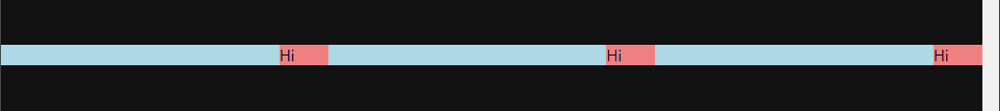

# margin

- ## 100% vs auto

  > - ### 100%
  >   가장 가까운 부모 요소를 기준으로 전체를 차지한다. **padding, margin 등을 고려하지 않고 100% 크기를 차지**한다. => padding, margin을 주면 밀려난다.

  > - ### auto
  >   height: 자식 콘텐츠 크기만큼 차지<br>
  >   width: 직계 부모의 콘텐츠 크기만큼 가득찬다.<br> > **auto는 padding, margin 등을 고려하여 차지**한다. 밀려나지 않아 유연하다.

- ## flexbox + margin

  => 부모에 flex 속성 + 자식 요소에 margin auto 이면 남은 여백을 균등하게 나눠가진다.

  ```html
  <!-- html -->
  <div class="container">
    <div class="content">Hi</div>
    <div class="content">Hi</div>
    <div class="content">Hi</div>
  </div>
  ```

  ```css
  /* css */
  .container {
    margin: 500px 0;
    display: flex;
    background-color: lightblue;
  }

  .content {
    width: 50px;
    background-color: lightcoral;
    /* 왼쪽 기준으로 균등하게 여백 나눠가진다. */
    margin-left: auto;
  }
  ```

    <div align="center">
    
    </div><br>

- ## 음수 마진
  => margin은 **차지하는 공간**을 뜻한다. margin 값을 바꿔도 보이는 디자인은 바뀌지 않는다.<br>
  => 마진에 음수값을 주면 차지하는 공간이 **밖으로 밀린다**.
