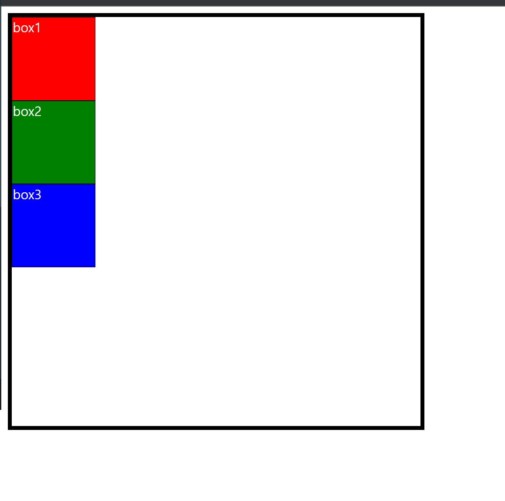
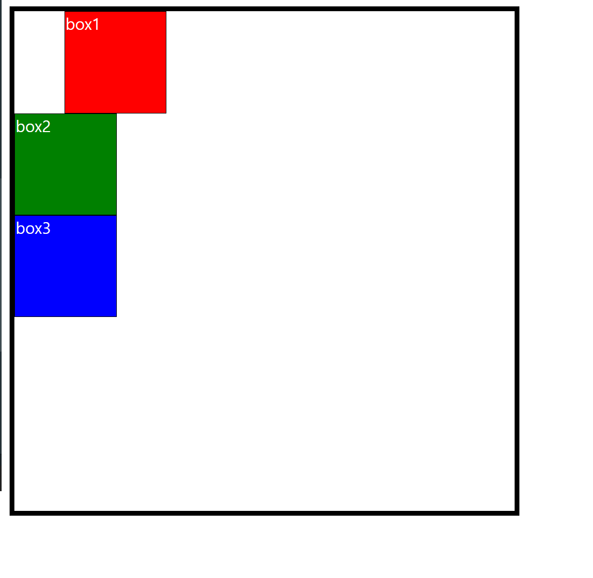

# position

- ## 정의

  **박스의 위치**를 정해주는 속성, position 속성을 통하여 웹 레이아웃을 짤 수 있다.

- ## 속성

  > ### 1. static

  default 속성, **html에 작성된 태그 순**으로 위치가 지정된다.
  <br><br>

  > ### 2. relative
  >
  > **원래 자신이 있던 위치를 기준**하여 상대적으로 위치가 지정

  ```html
  <!-- html -->
  <div class="container">
    <div class="inner">BOX1</div>
    <div class="inner">BOX2</div>
    <div class="inner">BOX3</div>
  </div>
  ```

  ```css
  /* css */
  .container {
    /* relative: 본래 static일 때 본인 위치를 기억 */
    position: relative;
    width: 500px;
    height: 500px;
    border: 5px solid black;
  }
  .inner {
    width: 100px;
    height: 100px;
    border: 1px solid black;
    color: white;
  }
  .inner:first-child {
    position: static;
    background-color: red;
  }
  .inner:nth-child(2) {
    position: static;
    background-color: green;
  }
  .inner:last-child {
    position: static;
    background-color: blue;
  }
  ```

    <div align="center">
    
    </div>
    => static 속성들은 순서대로 차곡차곡 위치한다.<br><br>
    * 첫 번째 박스에 속성을 부여한다.

  ```css
  .inner:first-child {
    position: relative;
    left: 50px;
    background-color: red;
  }
  ```

    <div align="center">
    
    </div>
    => 다음과 같이 첫 번째 박스가 static 기준으로 50px만큼 왼쪽으로 이동하였다.

  > ### 3. absolute
  >
  > **relative 속성을 지닌 가장 가까운 부모를 기준으로** 움직이거나, 없으면 html을 기준으로 움직인다.

  > ### 4. fixed VS sticky
  >
  > 두 속성 모두 스크롤을 해도 해당 위치에 고정시키고 싶을 때 사용하지만 차이가 있다.
  >
  > > ### `position: fixed;`
  > >
  > > **현재 뷰포트를 기준**으로 해당 요소가 고정된다.
  > >
  > > ### `position: sticky;`
  > >
  > > **부모 요소를 기준**으로 해당 요소가 고정된다.
