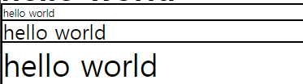

# 정렬

- ## line-height

  => 글자의 높이를 지정<br>

  1. number => 1은 font-size 값 만큼의 글자 높이를 의미, number로 line-height를 지정하면<br> **reading 영역이 사라진다**.
     - reading 영역 => 가독성을 위해 자동으로 생성된 공간 (margin, padding이 아님)
  2. px, em, % => 해당 단위에 맞춰 글자 높이가 설정, 폰트 크기 변경될 경우를 대비하여<br>
     **사용을 지양**하자.

- ## `line-height: 1`

```html
<!-- html -->
<div class="one">hello world</div>
<div class="two">hello world</div>
<div class="three">hello world</div>
```

```css
/* css: 클래스가 two인 박스에만 line-height:1 속성 부여 */
div {
  border: 1px solid black;
}
.one {
  font-size: 10px;
}
.two {
  font-size: 20px;
  line-height: 1;
}
.three {
  font-size: 30px;
}
```

<div align="center">
    
</div>
=> 다음과 같이 1, 3번째 박스에는 reading 영역이 존재하는 것을 알 수 있다.

<br>

<!-- * ## 정렬 방법론
1. position, transform -->
