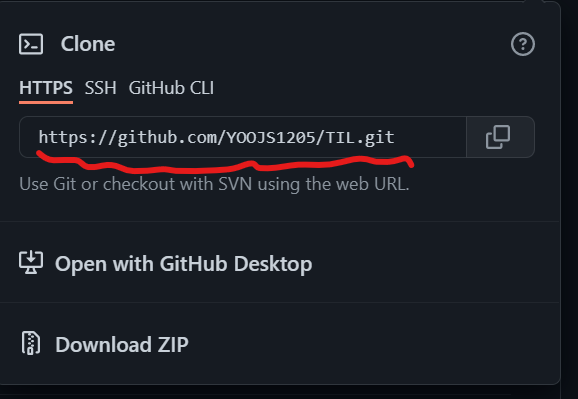

# Git의 기본

정의: Git은 소스코드 및 파일의 변경내역을 저장하는 **분산 버전 관리** 시스템

**Git과 Github는 완전히 다른 개념이다...!!**

- 저장소 만들기

1. 작업할 디렉토리를 만들고 생성한 디렉토리로 이동 
   `$ mkdir git-excercise`
2. 만든 디렉토리를 Git 저장소로 만들어 버전관리를 시작하기 
   `$ git init`

- commit 흐름

1. 처음 만들어진 레퍼지토리를 로컬 디렉토리로 끌고오기 (특히 현업할 때 사용한다.) 
   `$ git clone ~~~` \* clone 뒤에 오는 주소는 Github에 있는 레퍼지토리에서 복사하면 된다.
    
   => 이는 처음에만 사용된다. 
   => src 뒤에 .을 삽입하면 하위 디렉토리를 만들지 않는다.

2. push => 처음 clone이 완료되면 후에는 push로 레퍼지토리의 파일들을 가져온다. 
   `$ git push`
3. add => 변경사항을 commit할 준비를 한다. 보통은 변경사항을 모두 반영하기 때문에 .을 사용한다. 
   `$ git add . // 띄어쓰기 주의할 것`
4. commit => 반영된 변경사항을 Github의 레퍼지토리에 push할 준비를 한다. commit 메세지를 입력하지 않으면 오류가 발생한다. 
   `$ git commit -m "커밋 메세지"`
5. push => 변경사항들을 Github의 레퍼지토리에 반영한다. 
   `$ git push`
