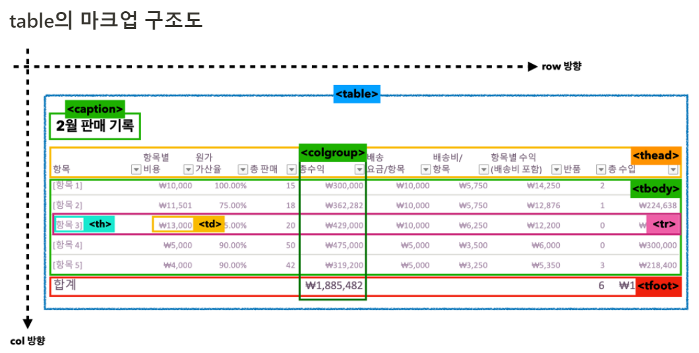
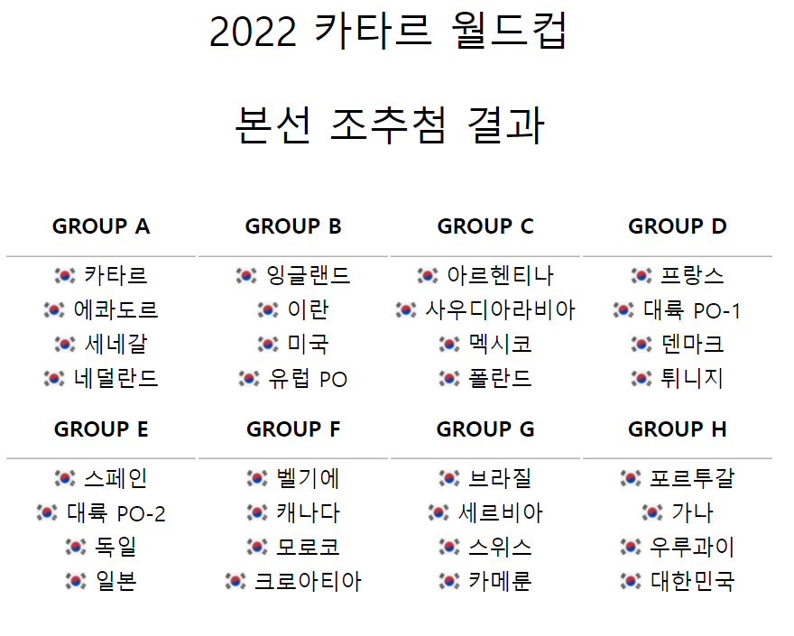

# Tabel 태그

<div align="center">
    
</div><br>

## 1. Tabel 태그

=> 테이블을 생성할 때 사용되는 태그

## 2. Caption 태그

=> 테이블의 제목이나 설명, **반드시 Tabel 태그의 첫 번째 자식 요소로 사용할 것**

## 3. thead, tbody, tfoot 태그

=> 테이블의 머리글, 본문 바닥을 의미, 단지 구역을 나누는 용도로 사용되며, **레이아웃에 영향을 미치지 않는다.**

## 4. tr, th, td 태그

1.  tr => 테이블의 행을 나눈다.
2.  td => 행에서 각 셀의 역할
3.  th => 행, 열의 머리말을 나타내는 데 사용, 굵은 글씨가 적용된다.
    > ### 속성
    >
    > td, th 태그에 다음과 같은 속성 사용이 가능하다.<br>
        1. colspan => 열간 병합 (**가로방향**)<br>
        2. rowspan => 행간 병합 (**세로방향**)

```html
<!DOCTYPE html>
<html lang="ko">
  <head>
    <meta charset="UTF-8" />
    <meta http-equiv="X-UA-Compatible" content="IE=edge" />
    <meta name="viewport" content="width=device-width, initial-scale=1.0" />
    <title>table</title>
    <style>
      caption {
        font-size: 30px;
      }
      th {
        border-bottom: 1px solid rgba(0, 0, 0, 0.3);
        padding: 12px 0;
        width: 140px;
      }
      td {
        text-align: center;
      }

      img {
        width: 16px;
      }
    </style>
  </head>
  <body>
    <table>
      <caption>
        2022 카타르 월드컵
        <p>본선 조추첨 결과</p>
      </caption>
      <tr>
        <th>GROUP A</th>
        <th>GROUP B</th>
        <th>GROUP C</th>
        <th>GROUP D</th>
      </tr>
      <tr>
        <td>
          
          카타르
        </td>
        <td>
          
          잉글랜드
        </td>
        <td>
          
          아르헨티나
        </td>
        <td>
          
          프랑스
        </td>
      </tr>
      <tr>
        <td>
          
          에콰도르
        </td>
        <td>
          
          이란
        </td>
        <td>
          
          사우디아라비아
        </td>
        <td>
          
          대륙 PO-1
        </td>
      </tr>
      <tr>
        <td>
          
          세네갈
        </td>
        <td>
          
          미국
        </td>
        <td>
          
          멕시코
        </td>
        <td>
          
          덴마크
        </td>
      </tr>
      <tr>
        <td>
          
          네덜란드
        </td>
        <td>
          
          유럽 PO
        </td>
        <td>
          
          폴란드
        </td>
        <td>
          
          튀니지
        </td>
      </tr>
      <th>GROUP E</th>
      <th>GROUP F</th>
      <th>GROUP G</th>
      <th>GROUP H</th>
      <tr>
        <td>
          
          스페인
        </td>
        <td>
          
          벨기에
        </td>
        <td>
          
          브라질
        </td>
        <td>
          
          포르투갈
        </td>
      </tr>
      <tr>
        <td>
          
          대륙 PO-2
        </td>
        <td>
          
          캐나다
        </td>
        <td>
          
          세르비아
        </td>
        <td>
          
          가나
        </td>
      </tr>
      <tr>
        <td>
          
          독일
        </td>
        <td>
          
          모로코
        </td>
        <td>
          
          스위스
        </td>
        <td>
          
          우루과이
        </td>
      </tr>
      <tr>
        <td>
          
          일본
        </td>
        <td>
          
          크로아티아
        </td>
        <td>
          
          카메룬
        </td>
        <td>
          
          대한민국
        </td>
      </tr>
    </table>
  </body>
</html>
```

- 결과
<div align="center">
    
</div><br>

## 5. colgroup, col 태그

=> 한 열에 고통적인 스타일을 주는 경우 사용

## 6. scope 속성

=> **th 태그에** scope 속성을 사용하여 td 태그와의 연결 관계를 설정할 수 있다.
