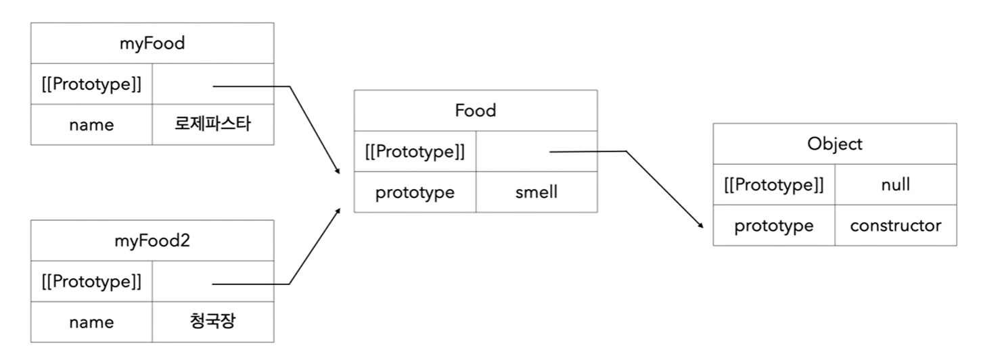

- ## 생성자 함수 예시 (한계점)

  ```javascript
  // 생성자 함수
  function Food(name) {
    this.name = name;
    this.smell = function () {
      console.log(`${this.name} 냄새가 난다.`);
    };
  }

  // 인스턴스 생성
  const myFood1 = new Food("로제 파스타");
  const myFood2 = new Food("크림 파스타");

  // 한계점 (각 인스턴스는 메서드를 공유하지 않고 중복 소유한다.)
  myFood1.Food === myFood2.Food; // false
  ```

- ## 그래서 프로토타입...!!

  ```javascript
  // 시도 1. this 사용
  function smell() {
      console.log(`${this.name} 냄새가 난다.`);
  }

  function Food(name) {
      this.name = name;
      this.smell = smell;
  }
  /* 해결은 된다.

  ```

  ```javascript
  // 프로토타입
  function Food(name) {
    this.name = name;
  }

  Food.prototype.smell = function () {
    console.log(`${this.name} 냄새가 난다.`);
  };
  ```

- ## Object.prototype.constructor

  1. 모든 인스턴스는 내부에 [[Prototype]] 프로퍼티를 가지며, 이를 통해 생성자의 prototype 프로퍼티를 추적한다.
  2. 인스턴스에서 생성자의 [[Prototype]]을 타고 올라가며 프로퍼티를 탐색하는 현상을 **프로토타입 체인**이라고 한다.<br><br>
  <div align='center'>
  
  </div><br>

  ```javascript
  // 생성자 함수
  function Food(name) {
    this.name = name;
    this.smell = function () {
      console.log(`${this.name} 냄새가 난다.`);
    };
  }

  // 인스턴스 생성
  const myFood1 = new Food("로제 파스타");
  const myFood2 = new Food("크림 파스타");

  /* myFood1, myFood2의 constructor는 Food (생성자)
     Food의 상위 constructor는 object
  */
  /* myFood1, myFood2의 [[Prototype]]은 그들의 생성자인 prototype 프로퍼티를 참조 (smell)
     Food의 [[Prototype]]은 그의 생성자인 Object의 prototype 프로퍼티를 참조
  */
  ```
