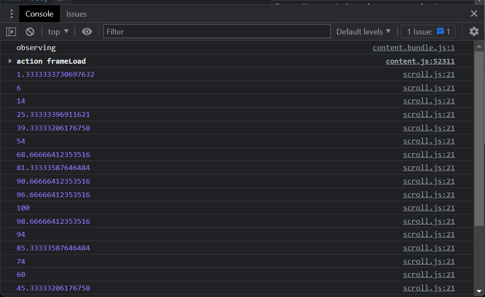
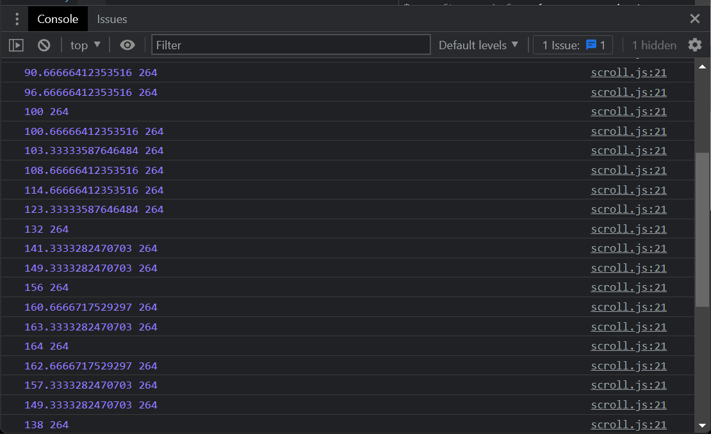

# Scroll Event

### Scroll 이벤트를 통하여 스크롤바를 조작할 때 마다 코드를 실행시킬 수 있다...!

## 1. 전체 페이지 스크롤

1. `window.scrollX`, `window.scrollY`
   => 브라우저가 각각 가로축, 세로축으로 **몇 px만큼 스크롤됐나** 알려줌

```javascript
window.addEventListner("scroll", () => {
  console.log(window.scrollY); // 브라우저가 세로축으로 얼마나 스크롤됐는가
});
```

- 결과<br><br>
  <br>
  => 다음과 같이 스크롤 될 때마다 스크롤된 px 값을 콘솔창에 제시한다.

## 2. scrollTo 함수

=> 강제로 스크롤바를 움직인다.

```javascript
window.scrollTo(0, 100); // 세로축으로 100만큼 이동시킨다.
```

## 3. scrollBy 함수

=> 현재 위치에서 스크롤해서 내려준다.

```javascript
window.scrollBy(0, 100); // 현재 위치에서 해당 위치로 스크롤해준다.
```

## 4. scrollTop

=> **페이지가 아닌** 특정 요소가 스크롤된 값을 나타낸다.

## 5. scrollHeight

=> 특정 요소가 스크롤될 수 있는 높이를 나타낸다.

```javascript
const box = document.querySelector(".box");
box.addEventListner("scroll", () => {
  console.log(box.scrollTop, box.scrollHeight);
});
```

- 결과<br><br>
  <br>
  => 다음과 같이 스크롤 될 때마다 스크롤된 값, 스크롤 가능한 높이를 콘솔창에 제시한다.

## 공식

`scrollHeight = scrollTop + clientHeight`

## 주의점

Scroll 이벤트는 컴퓨터에 굉장한 부하를 주는 이벤트이기 때문에 많이 쓰면 좋지 않다.
