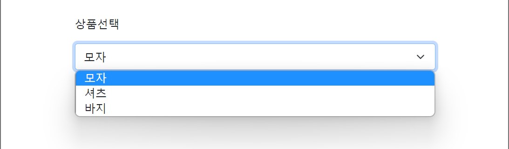
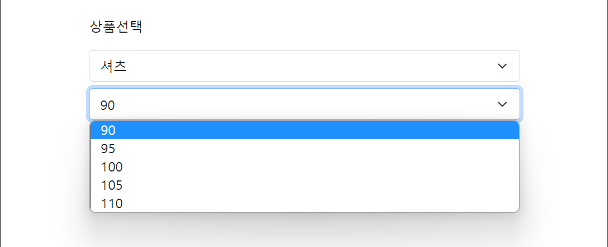

# Selector UI 만들기 (반복문 + 요소 삽입 DOM)

- ## Selector UI

<div align="center">
    
    
</div><br>

=> 다음과 같이 상품 종류를 선택할 수 있는 UI와 셔츠, 바지를 선택하면 해당되는 사이즈를 선택할 수 있는 UI가 나타나는 기능을 구현하였다.

- ## 방법론

```html
<!-- html -->
<form class="container my-5 form-group">
  <p>상품선택</p>
  <select class="form-select mt-2">
    <option value="cap">모자</option>
    <option value="shirt">셔츠</option>
    <option value="pant">바지</option>
  </select>
  <select class="form-select mt-2 hidden"></select>
</form>
```

```javascript
// javascript
// 서버와의 통신없이 임의로 사이즈를 변수로 저장하여 구현
const First = document.querySelectorAll(".form-select")[0];
const Second = document.querySelectorAll(".form-select")[1];

// 사이즈 정보
const PantsSize = [28, 30, 31, 32, 33, 34];
const ShirtsSize = [90, 95, 100, 105, 110];
```

1. innerHTML 함수를 사용하여 셔츠, 바지 선택 시 두 번째 선택창 초기화
2. forEach와 insertAdjacentHTML 함수를 사용하여 해당 데이터의 수만큼 option 태그 삽입

```javascript
// javascript
const onSelectShirt = (e) => {
  if (e.target.value === "shirt") {
    Second.classList.remove("hidden"); // 두 번째 선택창 나타내기
    Second.innerHTML = ""; // 초기화
    ShirtsSize.forEach((size) => {
      const Shirt = `<option>${size}</option>`;
      Second.insertAdjacentHTML("beforeend", Shirt); // 데이터 수 만큼 삽입
    });
  } else if (e.target.value === "pant") {
    Second.classList.remove("hidden");
    Second.innerHTML = "";
    PantsSize.forEach((size) => {
      const Pant = `<option>${size}</option>`;
      Second.insertAdjacentHTML("beforeend", Pant);
    });
  } else {
    Second.classList.add("hidden");
  }
};

First.addEventListener("change", onSelectShirt);
```
