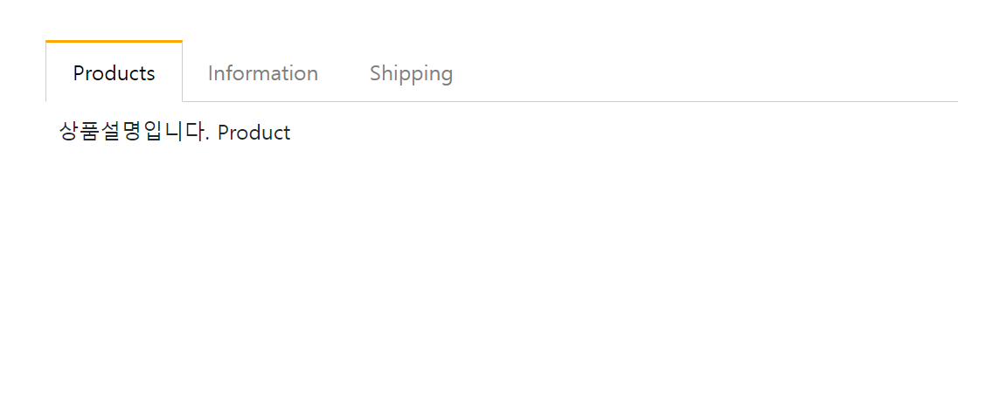

# 여러가지 방법으로 Tab UI 만들기

- ## Tab UI<br><br>
<div align="center">
    
</div><br>

=> 다음과 같이 **버튼을 누르면 해당 콘텐츠를 보여주는** UI이다.

- ## 방법론

```html
<!-- html -->
<div class="container mt-5">
  <ul class="list">
    <li class="tab-button" data-id="0">Products</li>
    <li class="tab-button orange" data-id="1">Information</li>
    <li class="tab-button" data-id="2">Shipping</li>
  </ul>
  <div class="tab-content">
    <p>상품설명입니다. Product</p>
  </div>
  <div class="tab-content show">
    <p>스펙설명입니다. Information</p>
  </div>
  <div class="tab-content">
    <p>배송정보입니다. Shipping</p>
  </div>
</div>
```

```javascript
// javascript
// Selector 변수화하기
const Button = document.querySelectorAll(".tab-button");
const Box = document.querySelectorAll(".tab-content");
const List = document.querySelector(".list");
```

1. 모든 버튼 요소에 orange 클래스를 삭제
2. 눌린 버튼 요소에 orange 클래스를 추가
3. 모든 콘텐츠 요소에 show 클래스를 삭제
4. 눌린 버튼 요소에 해당되는 콘텐츠 요소에 show 클래스를 추가
   <br><br>

- ## 시도해본 여러가지 방법들

> ### 1. 반복문 사용

```javascript
for (let i = 0; i < 3; i++) {
  Button[i].addEventListener("click", () => {
    Button.forEach((Button) => {
      Button.classList.remove("orange");
    });
    Button[i].classList.add("orange");
    Box.forEach((Box) => {
      Box.classList.remove("show");
    });
    Box[i].classList.add("show");
  });
}
```

=> 단점: 이벤트리스너를 여러번 호출하여 메모리 사용량이 증가한다.

> ### 2. 이벤트 버블링 활용 (이벤트 위임 => **공통되는 부모에 이벤트리스너 할당**)

```javascript
List.addEventListener("click", (e) => {
  for (let i = 0; i < 3; i++) {
    if (e.target === Button[i]) {
      Button.forEach((Button) => {
        Button.classList.remove("orange");
      });
      Button[i].classList.add("orange");
      Box.forEach((Box) => {
        Box.classList.remove("show");
      });
      Box[i].classList.add("show");
    }
  }
});
```

=> CPU 연산 이슈가 있지만, 신경 쓸 정도는 아님.

**추가적인 방법을 모색해봐야겠다.**
