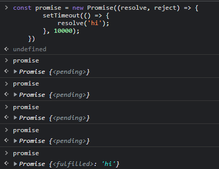
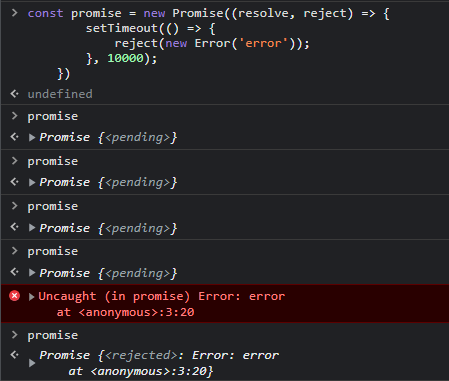

# 2. Promise

- ## 0. 정의

  1. 콜백함수로 비동기 처리할때의 문제점을 보완하기 위해 나온 객체
  2. Promise 생성자 함수를 new 연산자와 함께 프로미스 객체 생성<br><br>

  > - Promise 생성자 함수의 2가지 인수
  >
  > 1. resolve 콜백 함수 => 비동기 처리 성공 시 호출
  > 2. reject 콜백 함수 => 비동기 처리 실패 시 호출

  ```javascript
  // Promise 객체 생성 예시
  const promise = new Promise((resolve, reject) => {
    console.log("hi");
  });
  ```

- ## 1. Promise의 3가지 상태

  1. pending: 처리가 완료되지 않은 상태
  2. fulfilled: 성공적으로 처리가 완료된 상태
  3. rejected: 처리가 실패로 끝난 상태

  ```javascript
  const promise = new Promise((resolve, reject) => {
    setTimeout(() => {
      resolve("hi");
    }, 10000);
  });

  // 10초 동안은 pending 상태
  // 10초 후에 fulfilled 상태
  ```

    <div>
    
    </div><br>

  - reject 경우에는 Error라는 오브젝트를 통해서 값을 전달한다.

  ```javascript
  const promise = new Promise((resolve, reject) => {
    setTimeout(() => {
      reject(new Error("error"));
    }, 10000);
  });
  ```

    <div>
    
    </div>

- ## 2. 후속 처리 메서드 (then, catch, finally)

  ### 0. 정의

  => 프로미스 객체 상태의 변화에 따른 후속 처리를 하기 위한 메서드, 후속 처리 메서드에 인수로 전달된 **콜백 함수가 선택적으로 호출**된다.

  ### 1. then

  - then 메서드가 받는 2개의 콜백 함수
    1. fulfilled 상태에 호출되는 콜백 함수 (resolve 함수가 호출된 상태)
    2. rejected 상태에 호출되는 콜백 함수 (reject 함수가 호출된 상태)

  ```javascript
  const promise = new Promise((resolve, reject) => {
    setTimeout(() => {
      resolve("hi");
    }, 10000);
  }).then((text) => console.log(text));
  // 10초 뒤에 프로미스 객체가 fulfilled 상태가 되면 hi가 출력된다.
  // resolve 메서드 안의 텍스트가 콜백 함수의 인수로 전달된다.
  ```

  ```javascript
  // 2개의 콜백 함수를 모두 적용한 경우
  const promise = new Promise((resolve, reject) => {
    setTimeout(() => {
      reject(new Error("rejected!"));
    }, 10000);
  }).then(
    (text) => console.log(text),
    (error) => console.error(error)
  );
  // 10초 뒤에 에러가 발생한다.
  ```

  ### 2. catch

  - catch 메서드는 rejected 상태에 호출되는 콜백 함수만 인수로 전달받는다.

  ```javascript
  const promise = new Promise((resolve, reject) => {
    setTimeout(() => {
      reject(new Error("rejected!"));
    }, 10000);
  })
    .then((data) => console.log(data))
    .catch((error) => console.log(error));

  /* 10초 뒤에 프로미스 객체가 reject인 상태이므로 then 메서드는 건너뛰고
     catch 메서드가 호출된다. */
  ```

  ### 3. finally

  - finally 메서드는 프로미스의 상태가 fulfilled, reject에 상관없이 마지막에 호출된다.

  ```javascript
  const promise = new Promise((resolve, reject) => {
    setTimeout(() => {
      reject(new Error("rejected!"));
    }, 10000);
  })
    .then((data) => console.log(data))
    .catch((error) => console.log(error))
    .finally(() => console.log("finally"));
  ```
