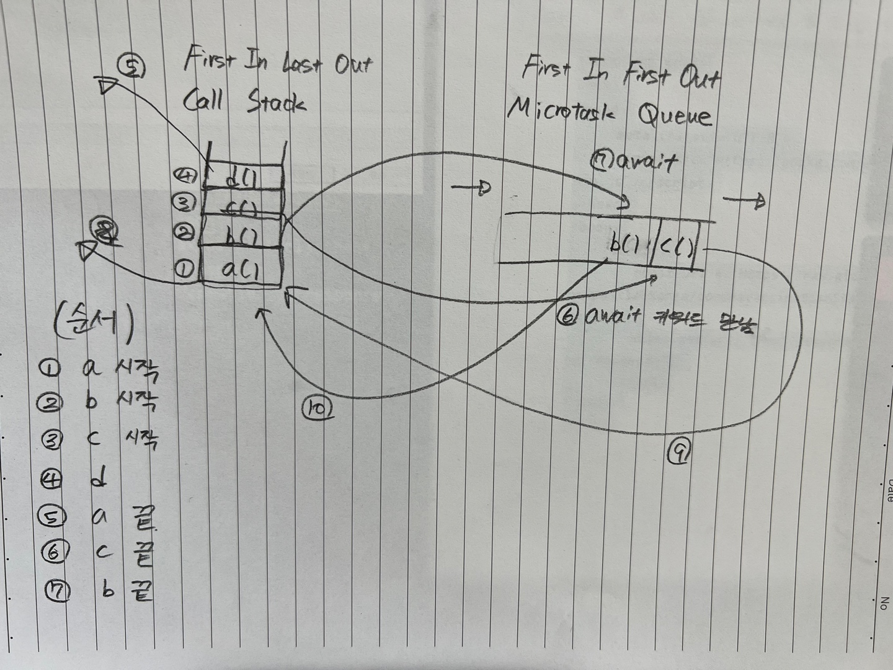

# 3. async, await

- ## 0. 등장 배경

  - 프로미스의 아쉬운 점

    1. 프로미스로 비동기 처리를 할 때 콜백 헬에 빠지지는 않지만 then 지옥이 발생할 수 있다.
    2. 특정 조건에 따라 분기를 나누기가 어렵다.
    3. 어떤 부분에서 에러가 발생했는지 파악하기가 어렵다. => 체이닝 때문

  - async와 await도 프로미스를 기반으로 동작한다.

  - 특징
    1. 프로미스의 then 메서드 없이도 비동기 처리 패턴을 동기처럼 구현 가능하다.
    2. 문법적 설탕이라 불리기도 한다.
    3. 여러 개의 비동기 처리를 구현할 때 유리하다.

- ## 1. async 함수의 사용

  1. 함수 선언식으로 사용

  ```javascript
  async function sayHi() {
    return "hi";
  }

  // async 함수의 반환값은 항상 프로미스 객체이다.
  // 반환값에 프로미스가 명시되지 않으면 fullfilled 상태인 프로미스가 반환된다.
  ```

    <div>
    
    </div>

  2. 함수 표현식으로 사용

  ```javascript
  const sayHi = async function () {
    return "hi";
  };

  // 함수 표현식은 화살표 함수로도 가능하다.
  const sayBye = async () => {
    return "bye";
  };
  ```

  - async 함수는 프로미스 객체를 반환하므로 후속 처리 메서드 사용이 가능하다.
  - async 함수는 함수 내부에서 비동기 처리를 할 것이라고 명시하는 역할<br><br>

- ## 2. async와 await의 조합

  - await의 역할
    1. 프로미스의 수행 결과를 기다렸다가 수행이 완료되면 프로미스의 **처리 결과를 반환**한다.
    2. async 함수 내부에서 비동기 처리 작업이 필요하면 await 키워드를 사용한다.

  ```javascript
  // Promise 예제
  function sayHi() {
    return new Promise((resolve, reject) => {
      setTimeout(() => {
        resolve("hi");
      }, 3000);
    });
  }

  console.log("start");
  sayHi()
    .then(() => {
      console.log("hi");
      return sayHi();
    })
    .then(() => {
      console.log("hi");
      return sayHi();
    })
    .then(() => {
      console.log("hi");
      return sayHi();
    });
  console.log("finish");

  // 우리의 예상: start - hi - hi - hi - finish
  // 결과: start - finish - hi - hi - hi

  // sayHi는 비동기 처리이기 때문에 예약하고 넘어간다. 바로 finish 출력
  ```

  ```javascript
  // async, await 방식으로 변경해보기
  async function run() {
    console.log("start");
    const hi1 = await sayHi();
    console.log(hi1);
    const hi2 = await sayHi();
    console.log(hi2);
    const hi3 = await sayHi();
    console.log(hi3);
    console.log("end");
  }
  ```

  ```javascript
  async function run2() {
    console.log("parent start");
    await run();
    console.log("parent finish");
  }
  run2();

  // parent start - start - hi - hi - hi - end - parent finish
  ```

  - 주의점

    1. await 키워드는 **반드시 프로미스 앞에서 사용**해야 한다.
    2. await 키워드는 **반드시 async 함수 내부에서 사용**해야 한다.

* ## 3. 예제

  ```javascript
  const snack = () => Promise.resolve("와, 맛있겠다!"); // 4번

  async function mySnack() {
    console.log("치즈 케이크 주세요!"); // 3번
    const res = await snack(); // 4번
    console.log(res); // 6번
  }

  console.log("주문하시겠어요?"); // 1번
  mySnack(); // 2번
  console.log("주문하신 케이크 나왔습니다!"); // 5번

  // 주문하시겠어요? - 치즈 케이크 주세요! - 주문하신 케이크 나왔습니다! - 와, 맛있겠다!
  ```

  1. 전역의 `console.log('주문하시겠어요?')` 호출
  2. mySnack() 함수 호출
  3. 함수 내부의 `console.log('치즈 케이크 주세요!')` 호출
  4. 비동기 처리 작업인 `const res = await snack()` 만남
  5. res가 마이크로태스크 큐로 이동
  6. `console.log('주문하신 케이크 나왔습니다!')` 가 콜 스택으로 이동
  7. `console.log('주문하신 케이크 나왔습니다!')` 호출
  8. `console.log(res)` 호출<br><br>

* ## 3.1 변형 예제

  ```javascript
  // 예제 1
  const snack = () => Promise.resolve("와, 맛있겠다!");
  const test = Promise.resolve(
    setTimeout(() => {
      console.log("test");
    })
  );

  async function mySnack() {
    console.log("치즈 케이크 주세요!");
    const testRes = await test;
    const res = await snack();
    console.log(testRes);
    console.log(res);
  }

  console.log("주문하시겠어요?");
  mySnack(); // 2번
  console.log("주문하신 케이크 나왔습니다!");
  ```

  ```javascript
  // 예제 2
  const a = () => {
    console.log("a 시작");
    b();
    console.log("a 끝");
  };

  const b = async () => {
    console.log("b 시작");
    await c();
    console.log("b 끝");
  };

  const c = async () => {
    console.log("c 시작");
    await d();
    console.log("c 끝");
  };

  const d = () => {
    console.log("d");
  };

  a();
  ```

  <div align='center'>
  
  </div><br>

* ## 콜 스택, 마이크로태스크 큐, 매크로태스크 큐

<div align='center'>

</div><br>

- 우선순위<br>
  => 콜 스택 - 마이크로태스크 큐(Promise), 매크로태스크 큐(setTimeout...)

- ### 참고

  - https://velog.io/@yejineee/%EC%9D%B4%EB%B2%A4%ED%8A%B8-%EB%A3%A8%ED%94%84%EC%99%80-%ED%83%9C%EC%8A%A4%ED%81%AC-%ED%81%90-%EB%A7%88%EC%9D%B4%ED%81%AC%EB%A1%9C-%ED%83%9C%EC%8A%A4%ED%81%AC-%EB%A7%A4%ED%81%AC%EB%A1%9C-%ED%83%9C%EC%8A%A4%ED%81%AC-g6f0joxx

  - https://velog.io/@hjkdw95/%EC%99%9C-%EB%B9%84%EB%8F%99%EA%B8%B0%EC%A0%81-%ED%94%84%EB%A1%9C%EA%B7%B8%EB%9E%98%EB%B0%8D%EC%9D%84-%ED%95%B4%EC%95%BC%ED%95%98%EB%8A%94%EA%B0%80

  - https://velog.io/@jjunyjjuny/JavaScript-asyncawait%EB%8A%94-%EC%96%B4%EB%96%BB%EA%B2%8C-%EB%8F%99%EC%9E%91%ED%95%A0%EA%B9%8C

  - https://www.youtube.com/watch?v=1z5bU-CTVsQ (생활코딩 async, await)
