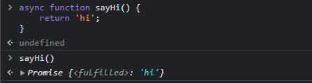

# 3. async, await

- ## 0. 등장 배경

  - 프로미스의 아쉬운 점

    1. 프로미스로 비동기 처리를 할 때 콜백 헬에 빠지지는 않지만 then 지옥이 발생할 수 있다.
    2. 특정 조건에 따라 분기를 나누기가 어렵다.
    3. 어떤 부분에서 에러가 발생했는지 파악하기가 어렵다.

  - async와 await도 프로미스를 기반으로 동작한다.

  - 특징
    1. 프로미스의 then 메서드 없이도 비동기 처리 패턴을 동기처럼 구현 가능하다.
    2. 문법적 설탕이라 불리기도 한다.

- ## 1. async 함수의 사용

  1. 함수 선언식으로 사용

  ```javascript
  async function sayHi() {
    return "hi";
  }

  // async 함수의 반환값은 항상 프로미스 객체이다.
  // 반환값에 프로미스가 명시되지 않으면 fullfilled 상태인 프로미스가 반환된다.
  ```

    <div>
    
    </div>

  2. 함수 표현식으로 사용

  ```javascript
  const sayHi = async function () {
    return "hi";
  };

  // 함수 표현식은 화살표 함수로도 가능하다.
  const sayBye = async () => {
    return "bye";
  };
  ```

  - async 함수는 프로미스 객체를 반환하므로 후속 처리 메서드 사용이 가능하다.<br><br>

- ## 2. async와 await의 조합

  - await의 역할
    => 프로미스의 수행 결과를 기다렸다가 수행이 완료되면 프로미스의 **처리 결과를 반환**한다.

  ```javascript
  // Promise 예제
  function sayHi() {
    return new Promise((resolve, reject) => {
      setTimeout(() => {
        resolve("hi");
      }, 3000);
    });
  }

  console.log("start");
  sayHi()
    .then(() => {
      console.log("hi");
      return sayHi();
    })
    .then(() => {
      console.log("hi");
      return sayHi();
    })
    .then(() => {
      console.log("hi");
      return sayHi();
    });
  console.log("finish");

  // 우리의 예상: start - hi - hi - hi - finish
  // 결과: start - finish - hi - hi - hi

  // sayHi는 비동기 처리이기 때문에 예약하고 넘어간다. 바로 finish 출력
  ```

  ```javascript
  // async, await 방식으로 변경해보기
  async function run() {
    console.log("start");
    const hi1 = await sayHi();
    console.log(hi1);
    const hi2 = await sayHi();
    console.log(hi2);
    const hi3 = await sayHi();
    console.log(hi3);
    console.log("end");
  }
  ```

  ```javascript
  async function run2() {
    console.log("parent start");
    await run();
    console.log("parent finish");
  }
  run2();

  // parent start - start - hi - hi - hi - end - parent finish
  ```

  - 주의점

    1. await 키워드는 **반드시 프로미스 앞에서 사용**해야 한다.
    2. await 키워드는 **반드시 async 함수 내부에서 사용**해야 한다.

  - 의문점<br>
    => 동기 처리 방식이랑 뭐가 달라?
