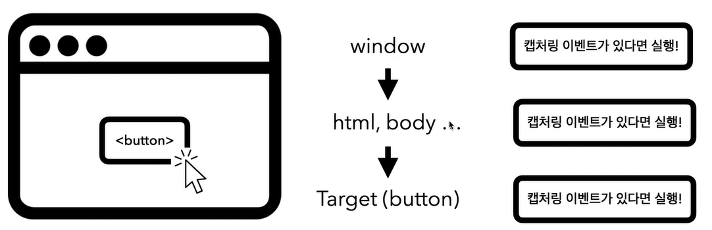
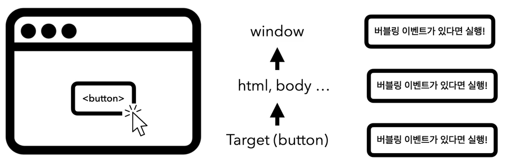

# 이벤트 흐름

- ## 브라우저가 사용자의 입력을 받았을 때 어떤 일이 일어날까?
  1. 브라우저 화면에서 이벤트 발생 (사용자 제스처)
  2. 브라우저가 이벤트 대상을 찾음
  3. 캡처링 단계 (해당 좌표에 위치한 요소의 이벤트 리스너 실행)
     - 캡처링 단계 과정 1. 최상위 객체인 window에서 부터 시작 2. 이벤트 리스너 등록 확인, 있으면 실행 3. 하위 요소로 이벤트 전파 4. 타겟 요소까지 이동 (캡쳐링) 5. 캡쳐링 후에 최상위 window 객체까지 계속 전파 (버블링)  
     

     
     

     
 
     
     

