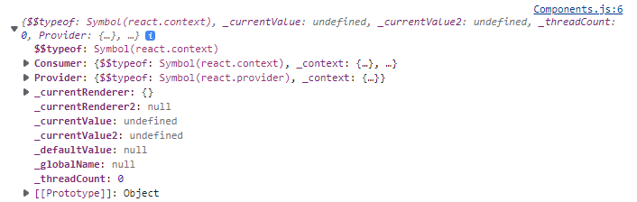

# Context

## 목차
1. [정의](#정의)
2. [Why Context?](#why-context)
3. [When?](#when)
4. [사용법](#사용법)
5. [Context로 상태관리하기](#context로-상태관리하기)

## 정의
다음은 React 공식문서에서 `Context`에 대해서 정의한 내용입니다.
<br><br>

`Context를 이용하면 단계마다 일일이 props를 넘겨주지 않고도 컴포넌트 트리 전체에 데이터를 제공할 수 있습니다.`
<br><br>

`Context`를 통해서 React Component간에 어떠한 값을 **전역적으로** 공유할 수 있습니다.
<br><br>

정의를 살펴보았을 때, 확실히 좋아보이긴 합니다. 왜 React에서 `Context`에 대한 개념이 생겨났을까요?
<br><br>

## Why Context?

React의 특성 중 하나인데, React는 **단방향 데이터 흐름**을 가지고 있습니다.
<br><br>

즉, React 애플리케이션에서 데이터는 **부모에서 자식 방향**으로만 `props`를 통해 전달됩니다.
<br><br>

이는 애플리케이션의 유지보수를 쉽게 해주는 React의 좋은 특징이라고 할 수 있지만, 번거로움이 존재합니다.
<br><br>

아래의 코드는 `Components`라는 상위 컴포넌트에서 `Third`라는 하위 컴포넌트로 특정 데이터를 전달하는 방식입니다.

```javascript
import React from 'react'

export default function Components() {
  const value = 'Hi';
  return (
    <First value={value} />
  )
}

function First({ value }) {
    return (
        <Second value={value} />
    )
}

function Second({ value }) {
    return (
        <Third value={value} />
    )
}

function Third({ value }) {
    return (
        <div>I'm Third + {value}</div>
    )
}
```

만약, 전달할 때 거쳐야할 Component가 위의 코드보다 훨씬 많다면 어떨까요? 또한, 전달해야 할 데이터가 여러개이면 어떨까요?
<br><br>

**props 추적이 굉장히 어려워지고, 그만큼 유지보수가 힘들어집니다.**
<br><br>

이러한 문제를 해결하기 위해 나온 방안들이 `Context`와 `Redux Recoil MobX`와 같은 라이브러리 들입니다.
<br><br>

## When?
React 공식문서에는 다음과 같은 상황에서 `Context`를 사용하라고 제시합니다.
<br><br>

`Context는 React 컴포넌트 트리 안에서 전역적이라고 볼 수 있는 데이터를 공유할 수 있도록 고안된 방법입니다.`
<br><br>

React 공식문서에서 또 하나 중요하게 언급하고 있는 점이 있습니다.
<br><br>

`단순한 props drilling을 대체하는 데에는 Context보다 컴포넌트 합성이 더 좋은 해결책일 수 있습니다.`
<br><br>

이 주제는 글 마지막에 한 번 더 다뤄보겠습니다.
<br><br>

## 사용법
함수형 컴포넌트로 설명하겠습니다.
<br>
* ## `createContext`

Context 객체를 생성합니다.
<br><br>
Context 객체를 구독하고 있는 컴포넌트를 렌더링할 때 React는 트리 상위에서 가장 가까이 있는 Provider로부터 현재값을 읽습니다.

```javascript
import { createContext } from 'react';

const MyContext = createContext();
console.log(MyContext);
```
<div align='center'>

</div>

```javascript
import React, { createContext, useContext } from 'react';

const MyContext = createContext();

export default function Components() {
  return (
    <MyContext.Provider value="hi">
        <First />
    </MyContext.Provider>
  )
}
```
`Provider`는 `value` prop을 받아서 해당 값을 하위에 있는 컴포넌트에 전달합니다.
<br><br>

`Provider` 하위에서 `Context`를 구독하는 모든 컴포넌트는 `Provider`의 `value`값이 변할 때마다 리렌더링 됩니다.
<br><br>

이제 `Provider`의 `value`를 전달받아 보겠습니다.
<br><br>

* ## `useContext`
`Provider`의 `value` 값을 받아옵니다.
```javascript
import React, { createContext, useContext } from 'react';

const MyContext = createContext();

export default function Components() {
  return (
    <MyContext.Provider value="hi">
        <First />
    </MyContext.Provider>
  )
}

function First() {
    return (
        <Second />
    )
}

function Second() {
    return (
        <Third />
    )
}

// Provider의 value 값을 가져옵니다.
function Third() {
    const useMyContext = useContext(MyContext);

    return (
        <div>I'm Third + {useMyContext}</div>
    )
}
```
`Context`를 통하여 `Third` 컴포넌트에서 `Components` 컴포넌트의 값을 매우 쉽게 받아왔습니다.
<br><br>

## Context로 상태관리하기
기본적인 구조는 다음과 같습니다.
```javascript
import React from 'react';

export default function Counter() {
  return (
    <div>
        <Value />
        <Buttons />
    </div>
  )
}

function Value() {
    return <h1>0</h1>;
}

function Buttons() {
    return (
        <div>
            <button>+</button>
            <button>-</button>
        </div>
    )
}
```
* `Value` 컴포넌트에서 `Context`의 `value`를 받아와서 화면에 제공합니다.
* `Buttons` 컴포넌트에서 `Context`의 `value`를 제어합니다.

### 1. ContextProvider 컴포넌트를 생성해줍니다.
```javascript
import React, { createContext, useContext, useState } from 'react';

const counterContext = createContext();

// CounterProvider 컴포넌트에서 value 값을 관리할 것입니다. (useState)
function CounterProvider( { children }) {
    const counterState = useState(0);
    return (
        <counterContext.Provider value={counterNum}>{children}</counterContext.Provider>
    )
}
```

### 2. Value 컴포넌트에서 Context의 value 값을 받아와서 화면에 제공합니다.
```javascript
function Value() {
    const [num] = useContext(counterContext);
    return <h1>{num}</h1>;
}
```

### 3. Buttons 컴포넌트에서 Context의 value 값을 관리합니다.
```javascript
function Buttons() {
    const [, setNum] = useContext(counterContext);

    const onClickPlusButton = () => {
        setNum(prev => prev + 1);
    }

    const onClickMinusButton = () => {
        setNum(prev => prev - 1);
    }
    return (
        <div>
            <button onClick={onClickPlusButton}>+</button>
            <button onClick={onClickMinusButton}>-</button>
        </div>
    )
}
```
완성 코드는 다음과 같습니다.
```javascript
import React, { createContext, useContext, useState } from 'react';

const counterContext = createContext();

export default function Counter() {
  return (
    <CounterProvider>
        <Value />
        <Buttons />
    </CounterProvider>
  )
}

function CounterProvider( { children }) {
    const counterState = useState(0);
    return (
        <counterContext.Provider value={counterState}>{children}</counterContext.Provider>
    )
}

function Value() {
    const [num] = useContext(counterContext);
    return <h1>{num}</h1>;
}

function Buttons() {
    const [, setNum] = useContext(counterContext);

    const onClickPlusButton = () => {
        setNum(prev => prev + 1);
    }

    const onClickMinusButton = () => {
        setNum(prev => prev - 1);
    }
    return (
        <div>
            <button onClick={onClickPlusButton}>+</button>
            <button onClick={onClickMinusButton}>-</button>
        </div>
    )
}
```